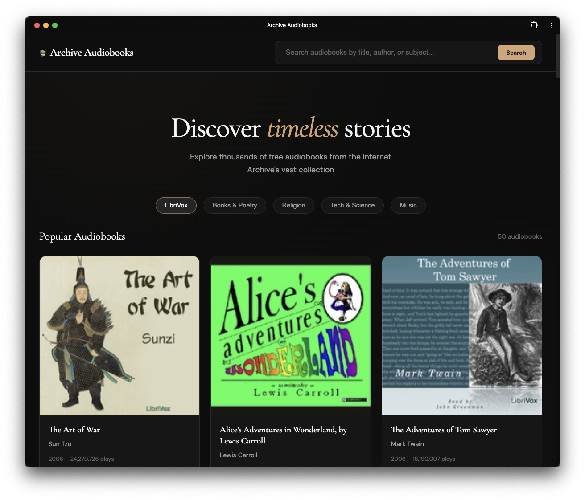
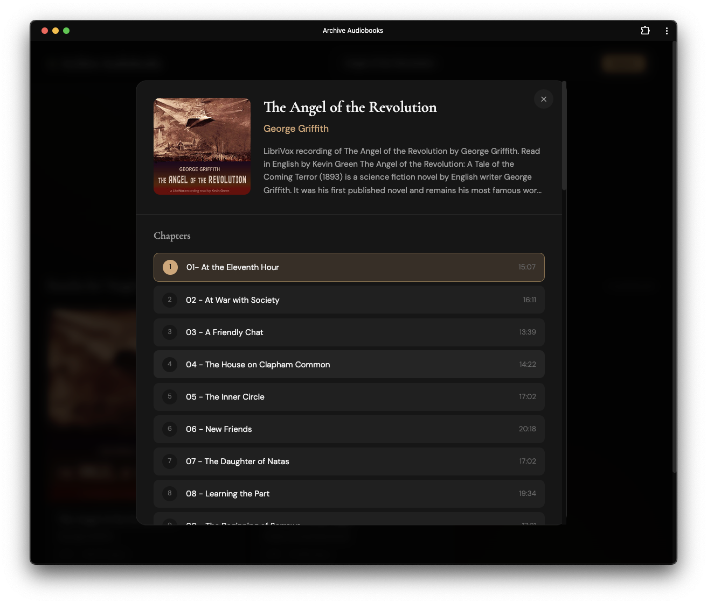

# Archive Audiobooks

A progressive web app for discovering and listening to free audiobooks from the Internet Archive.

<a style="color:#fff;" href="https://books.dieselpunkindustries.com/audio-books/" target="_blank" rel="noopener noreferrer">Audio Books at books.dieselpunkindustries.com</a>




## Features

- **Search & Discovery** — Browse thousands of free audiobooks from archive.org's vast collection
- **Multiple Collections** — Filter by LibriVox, Books & Poetry, Religion, Tech & Science, and Music
- **Beautiful Dark Interface** — Refined dark theme with warm copper accents
- **Chapter Navigation** — View and select individual chapters from the book detail modal
- **Plyr.js Audio Player** — Clean, customizable audio controls with keyboard shortcuts
- **Auto-Advance** — Automatically plays the next chapter when one finishes
- **PWA Support** — Install as a standalone app on desktop or mobile
- **Offline Caching** — Service worker caches assets for faster loading



## Installation

### As a Web App

Simply visit the hosted URL in any modern browser.

### As a PWA

1. Open the app in Chrome, Edge, or Safari
2. Click the install icon in the address bar (or "Add to Home Screen" on mobile)
3. The app will install and run standalone

### Self-Hosting

1. Clone or download the repository
2. Upload all files to your web server:
   ```
   index.html
   manifest.json
   sw.js
   icon-192.png
   icon-512.png
   ```
3. Ensure the directory has proper permissions (755 for folder, 644 for files)
4. Access via your server URL

### Local Development

```bash
# Using Node.js
npx serve .

# Using PHP
php -S localhost:8000

# Using Ruby
ruby -run -ehttpd . -p8000
```

## File Structure

```
archive-audiobooks/
├── index.html          # Main application
├── manifest.json       # PWA manifest
├── sw.js               # Service worker
├── sw.min.js           # Minified service worker
├── icon-192.png        # App icon (192x192)
├── icon-512.png        # App icon (512x512)
├── screenshot1.png     # App screenshot
├── screenshot2.png     # App screenshot
└── README.md           # This file
```

## Keyboard Shortcuts

| Key | Action |
|-----|--------|
| `Space` | Play / Pause |
| `Escape` | Close modal |

## Technical Details

- **API** — Uses the Internet Archive's Advanced Search API and Metadata API
- **Audio Player** — [Plyr.js](https://plyr.io/) v3.7.8
- **Fonts** — Cormorant Garamond (headings) + DM Sans (body)
- **Caching Strategy** — Cache-first for static assets, network-first for API calls

## Deployment Notes

### WordPress Sites

If deploying to a subdirectory on a WordPress site, add the directory to your `.htaccess` exclusions:

```apache
RewriteCond %{REQUEST_URI} !^/(audio-books)/
```

### Subdirectory Deployment

The app uses relative paths and dynamically determines its base URL, so it works in any subdirectory:
- `example.com/`
- `example.com/audio-books/`
- `example.com/apps/audiobooks/`

## Browser Support

- Chrome 80+
- Firefox 75+
- Safari 13+
- Edge 80+

## Credits

- Audio content provided by the [Internet Archive](https://archive.org)
- Many audiobooks from [LibriVox](https://librivox.org) volunteers
- Audio player by [Plyr](https://plyr.io)

## License

MIT License — Feel free to use, modify, and distribute.
